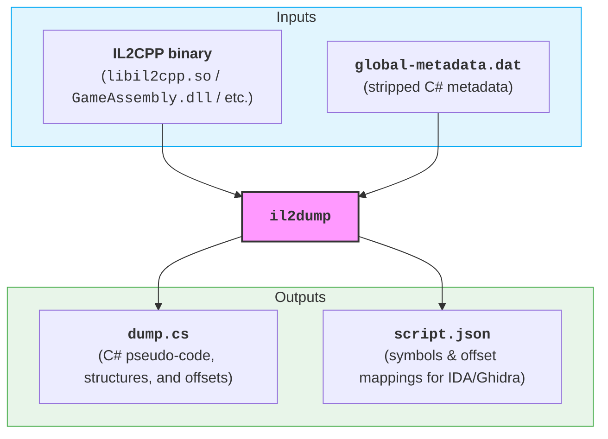

# `il2dump` 

A portable version of [**Il2CppDumper**](https://github.com/Perfare/Il2CppDumper) rewritten in Rust. It compiles to a single, standalone native binary with zero runtime dependencies, allowing you to build and use it on Windows, Linux, and macOS using standard tools.

An online demo using WebAssembly is available at <https://mathiasbynens.github.io/il2dump/>.

## What is IL2CPP and why dump it?

[**IL2CPP** (_Intermediate Language to C++_)](https://docs.unity3d.com/Manual/scripting-backends-il2cpp.html) is an ahead-of-time (AOT) compiler technology developed by Unity. It takes the compiled C# intermediate language (IL) assemblies of a Unity project, converts them to C++ source files, and compiles them into a native platform binary (such as `.so` ELF on Android, Mach-O on iOS/macOS, or `.dll`/`.exe` PE on Windows).

This compilation process:

1. Strips out C# metadata information (class structures, fields, and method names) and serializes it into a separate file named `global-metadata.dat`.
2. Compiles the actual executable code into native machine assembly instructions inside the main binary.

### Why dump it?

Because IL2CPP compiles code directly to native instructions and strips symbol definitions, decompiling the native binary directly in a reverse-engineering tool (like IDA Pro, Ghidra, or Binary Ninja) yields anonymous assembly code with no type structures, class names, or method names.

Dumping with `il2dump` resolves this by linking the native binary back with `global-metadata.dat`:

- It reconstructs a C# header file (`dump.cs`) displaying the original class/struct hierarchies, field offsets, and method virtual addresses (RVAs).
- It produces a symbol mapping (`script.json`) that can be loaded into your disassembler to automatically rename subroutines and reconstruct structure layouts, turning obfuscated assembly back into readable code.



## Features

- **Cross-platform:** Native support for Linux and macOS.
- **Format support:** Unified parsing of PE, ELF, and Mach-O formats (including fat multi-architecture binaries).
- **Stripped binary recovery:** Re-implemented symbol searching and heuristic pattern backtracking to locate registration structs when symbol information is missing.
- **Zero dependencies:** Compiles to a single binary requiring no .NET runtime, Mono, or other libraries.

---

## Installation

If you don’t plan on contributing to `il2dump` development and just need the binary, install its crate:

```bash
cargo install il2dump
```

## Local development

Ensure you have a standard build environment and the Rust compiler installed (e.g. via `rustup` or Homebrew).

Run the standard `make` command from the project root:

```bash
make
```

The compiled binary will be placed at `target/release/il2dump`.

To run the test suite:

```bash
make test
```

### Optional: installation

To install the binary globally (to `/usr/local/bin/il2dump`), run:

```bash
sudo make install
```

---

## Usage

Run `il2dump` with paths to your executable file and the Unity metadata file (`global-metadata.dat`):

```bash
il2dump <executable-file> <global-metadata> [output-directory]
```

### Outputs generated

- **`dump.cs`**: A C# pseudo-code representation containing namespaces, classes, fields with offset comments, and methods with RVA/offset comments.
- **`script.json`**: An offset-to-symbol JSON mapping suitable for importing into tools like Ghidra, IDA Pro, or Binary Ninja using original dumper scripts.

---

## Output and line count differences compared to Perfare’s `Il2CppDumper`

When comparing the `dump.cs` file generated by `il2dump` to the original `Il2CppDumper`, you may notice different line counts. These differences are expected and intentional:

1. **Serialization bug in the C# dumper**:
   - [The original Il2CppDumper has a reflection serialization bug](https://github.com/Perfare/Il2CppDumper/pull/923) where the `Il2CppType` union is decoded from the incorrect memory offset (`offset 12` instead of `offset 0`).
   - This causes the C# dumper to resolve type indices from corrupted/padding bytes, generating duplicated base interfaces (e.g. `IScope, IScope`) and mapping almost every generic interface instantiation in the binary to a single monolith (e.g., `IFactory<ConfirmDialog.Data, ...>`).
   - `il2dump` resolves these unions correctly, outputting correct, unique, and concise C# interface declarations, which reduces the output line count.

2. **Cleaned brace and empty class formatting**:
   - **Empty types**: `il2dump` formats empty classes/structs inline on a single line (e.g., `class MyClass {}`) instead of wrapping them across multiple lines.
   - **Leading newlines**: `il2dump` formats class open braces `{` directly above the first field or method header block instead of leaving a redundant blank line after `{`.

3. **Metadata updates**:
   - If the input files or game version change between runs, class layouts and compiled interface definitions will naturally shift, resulting in updated declarations.
